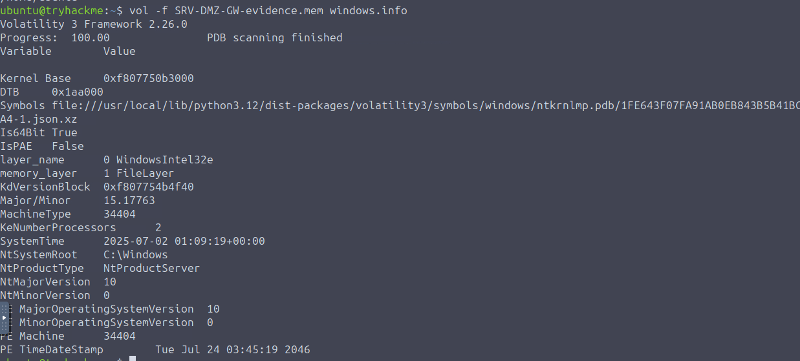
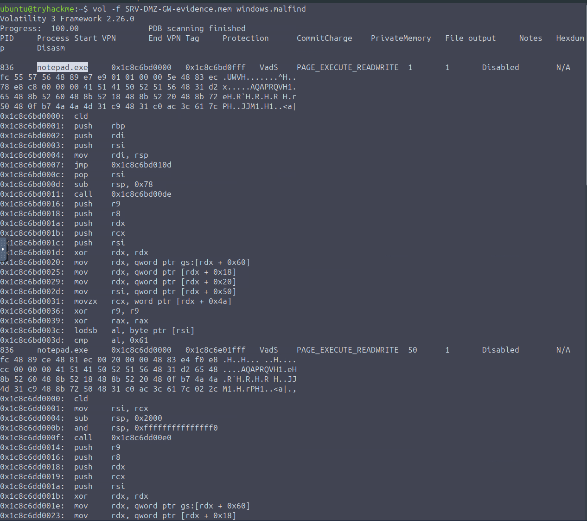
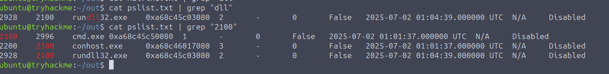
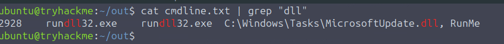
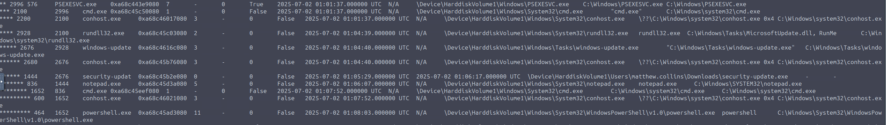
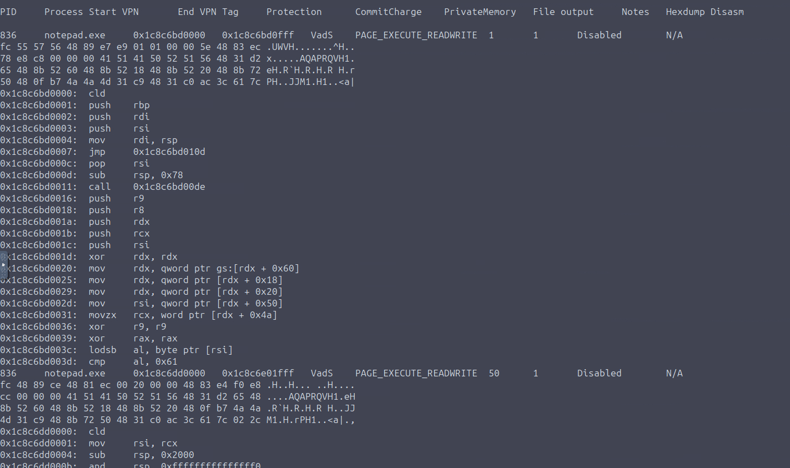
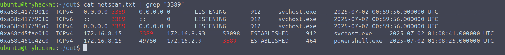

# Lost in RAMslation
Investigate the third, memory forensics part of the HoneyNet Collapse!

## Quick Overview
DeceptiTech is a fast-growing cyber security company specializing in honeypot development and deception technologies. At the heart of their success are DeceptiPots - lightweight, powerful, and configurable honeypots that you can install on any OS and capture every malicious action!

The internal DeceptiTech network is organized around a traditional on-premises Active Directory domain with approximately 50 active users. The product platform, however, is isolated and hosted entirely in the AWS cloud:

The challenge is based on TryHackMe, an you can find the [room here](https://tryhackme.com/room/lostinramslation) - Level HARD

Tools : 
- Volatility 

## Questions 

### What is the absolute path to the initial malicious file executed on this host?
First, let's take a quick look at the server.

Now, let's dive in order to file the malicious file.
`vol -f  windows.malfind`, we can fin two suspicious process : notepad.exe and powershell.exe 

Something interesting is that the process rundll32 was launch by cmd.exe (PPID 2100). Which can be an indicator that the malicious activity started with a dll.

-> C:\Windows\Tasks\MicrosoftUpdate.dll

### Which process ID (PID) was assigned to the process used to execute the initial payload?

As seen just before, rundll32.exe run on the PID 2928.

### What was the full command line used by the attacker to launch initial execution on this host?

Now that we are locked in with rundll32.exe, we can focus it on the cmdline file (or with `vol -f  windows.cmdline`)

-> rundll32.exe  C:\Windows\Tasks\MicrosoftUpdate.dll, RunMe

### The attack launched various processes. What is the name of the final process in the chain?

Ok, now we need to understand the chain of process created by the malicious dll. The pstree (`vol -f  windows.pstree`)

The last process created by the chain is notepad.exe (PPID 1444)

### What are the first five bytes (in hex, e.g., 4d5a9000) of the Meterpreter shellcode injected into it?

Ok, let's go back to our malfind extract. We know that the notepad.exe's process was created by our malicious chain. It might be carrying the meterpreter payload.

Two elemnts found 
- fc 55 57 56 48
- fc 48 89 ce 48

The seconde one contains the meterpreter payload.

### Which is the IP address that the hosts perform a lateral movement using port 3389?

To end this room, let's dive into the netscan extract `vol -f  windows.netscan`. One important thing; we know the port used whihc is 3389. With that information, we can then grep the content with this information.

The second IP linked to the port 3389 is performed in order to perform lateral movement.
